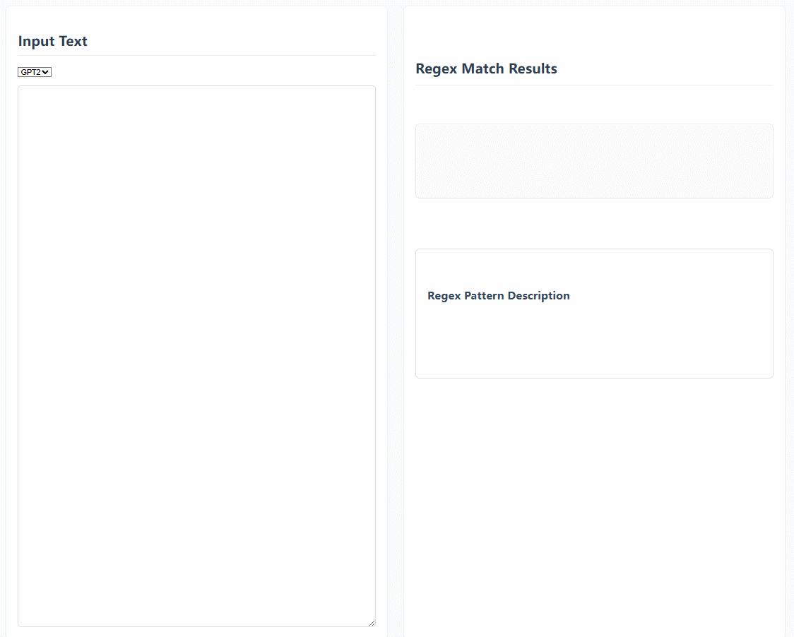

# Text Regex Pattern Visualization

<div align="center">
    
</div>

This project visualizes regex pattern matches in a given input text. It supports different tokenization patterns such as GPT2 and GPT4.

```python
# refer to https://github.com/karpathy/minbpe/blob/master/minbpe/regex.py
GPT2_SPLIT_PATTERN = r"""'(?:[sdmt]|ll|ve|re)| ?\p{L}+| ?\p{N}+| ?[^\s\p{L}\p{N}]+|\s+(?!\S)|\s+"""
GPT4_SPLIT_PATTERN = r"""'(?i:[sdmt]|ll|ve|re)|[^\r\n\p{L}\p{N}]?+\p{L}+|\p{N}{1,3}| ?[^\s\p{L}\p{N}]++[\r\n]*|\s*[\r\n]|\s+(?!\S)|\s+"""
```

## Setup

1. Clone the repository to your local machine.
2. Open the `index.html` file in your web browser.

## Usage

1. Select a tokenization pattern from the dropdown menu.
2. Enter the text you want to analyze in the textarea.
3. The regex match results will be displayed in the output section.

## Files

- `index.html`: The main HTML file that contains the structure of the web page.
- `styles.css`: The CSS file for styling the web page.
- `scripts.js`: The JavaScript file that contains the logic for tokenizing the input text and displaying the results.

## License

This project is licensed under the MIT License.
